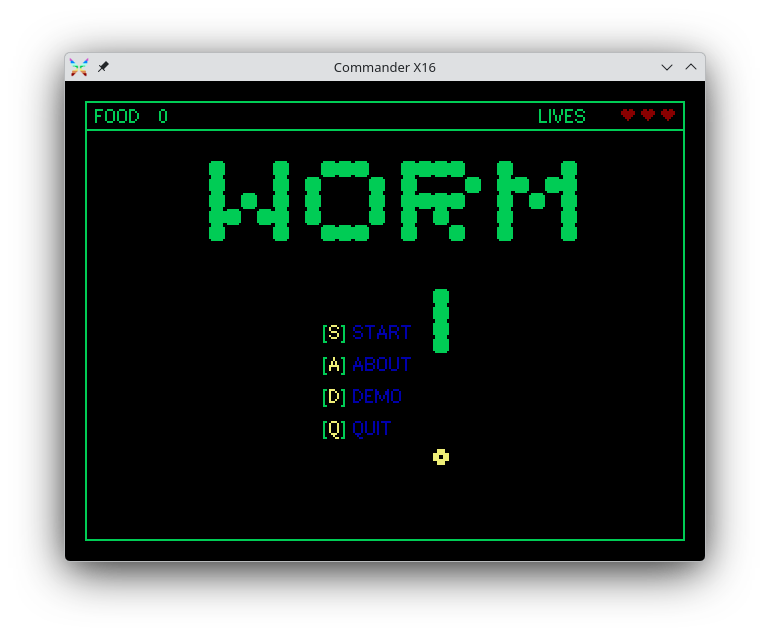
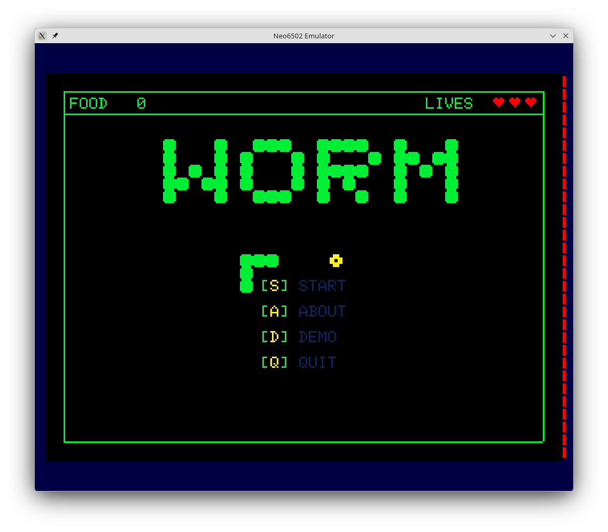
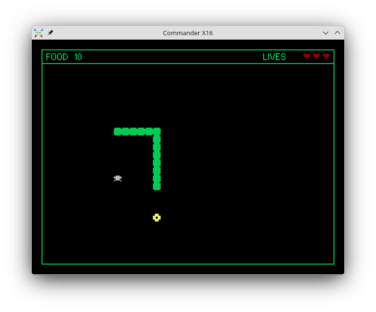
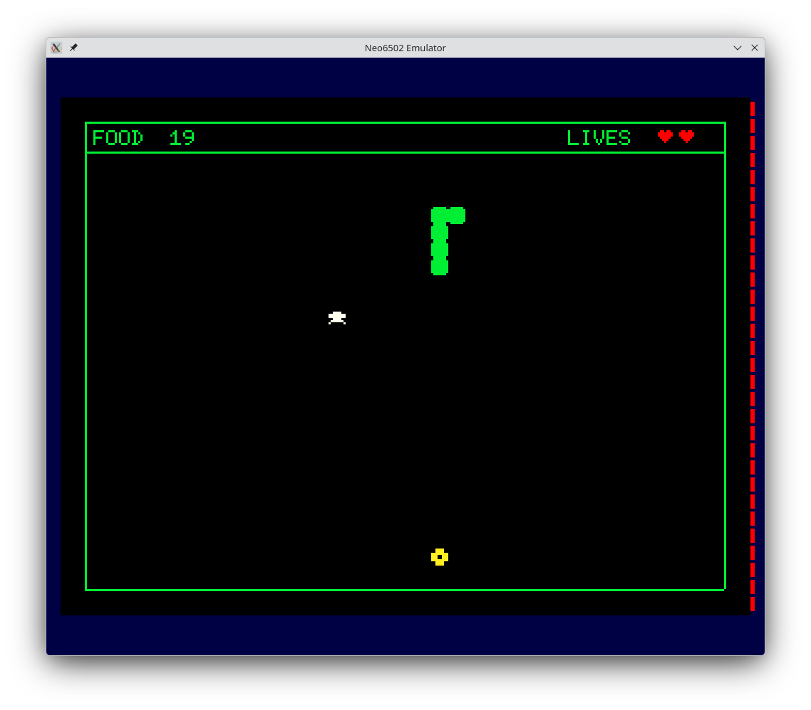

# Worm

A cross-platform snake-style game written in 6502 assembly language for the Commander X16 and Neo6502 retro computers.

## Screenshots

| Commander X16 | Neo6502 |
|:---:|:---:|
|  |  |
|  |  |

## Supported Platforms

| Platform | CPU | Output |
|----------|-----|--------|
| Commander X16 | 65C02 | `WORM.PRG` |
| Neo6502 | 65C02 | `worm.neo` |

## Prerequisites

- [cc65](https://cc65.github.io/) toolchain (`ca65`, `ld65`)
- [x16emu](https://www.commanderx16.com/) — Commander X16 emulator
- [Neo6502 emulator](https://www.olimex.com/Products/Retro-Computers/Neo6502/) (`neo`) and `exec.zip` conversion tool

## Building

```sh
make build-x16    # Build Commander X16 binary
make build-neo    # Build Neo6502 binary
make all          # Build all platforms
```

Each platform is assembled with its own define (`-D __X16__` or `-D __NEO__`), enabling conditional assembly where platform-specific behaviour is needed.

## Running

```sh
make run-x16      # Build and launch in x16emu
make run-neo      # Build and launch in Neo6502 emulator
```

## Cleaning

```sh
make clean        # Remove all build artifacts
```

## Game Manual

See [docs/MANUAL.md](docs/MANUAL.md) for the player-facing game manual, including controls, rules, and gameplay tips.

## Project Structure

```
worm/
├── cfg/                    # Linker configurations
│   ├── x16.cfg             #   Commander X16 memory map
│   └── neo.cfg             #   Neo6502 memory map
├── docs/                   # Documentation
│   ├── MANUAL.md           #   Game instruction manual
│   └── images/             #   Screenshots
├── src/
│   ├── main.asm            # Entry point and game flow dispatch
│   ├── api/                # Shared low-level utilities
│   │   ├── wm_equates.inc  #   Constants (grid sizes, colors, inputs)
│   │   ├── wm_drawing.asm  #   Grid-to-pixel math, cell erase
│   │   └── wm_text.asm     #   Text helpers, border drawing, title renderer
│   ├── app/                # Game logic modules
│   │   ├── game.asm        #   Main game loop and state machine
│   │   ├── worm.asm        #   Worm movement, body array, self-collision
│   │   ├── food.asm        #   Food spawning, collection, overlap checks
│   │   ├── spider.asm      #   Spider spawning, vulnerability, circular buffer
│   │   ├── life.asm        #   Lives, extra life pickups, respawn
│   │   ├── sound.asm       #   Frame-based sound effect sequencer
│   │   ├── menu.asm        #   Start screen and menu input
│   │   ├── menu_worm.asm   #   Decorative worm circling the menu
│   │   ├── about.asm       #   About/credits screen
│   │   ├── demo.asm        #   AI-controlled attract-mode demo
│   │   ├── overlays.asm    #   Pause, quit confirmation, game over screens
│   │   └── status_bar.asm  #   HUD: food count and lives display
│   └── system/             # Platform abstraction layer (HAL)
│       ├── x16/
│       │   └── platform.asm  # Commander X16 (VERA, KERNAL)
│       └── neo/
│           └── platform.asm  # Neo6502 (API calls)
├── build/                  # Build output (generated)
├── Makefile
└── README.md
```

## Architecture

The codebase is organised into three tiers:

- **`api/`** — Shared low-level utilities and constants used across the game. Grid-to-pixel math, text rendering, border drawing, and the bitmap-based title renderer live here.
- **`app/`** — Game logic modules. Each file owns a single responsibility (worm movement, food spawning, spider management, sound sequencing, etc.). Modules communicate through exported symbols and shared variables.
- **`system/`** — Platform abstraction layer. Each platform implements a common HAL interface, isolating all hardware-specific code. The game logic never calls platform APIs directly — only the HAL routines.

### Platform HAL Interface

Each platform's `platform.asm` exports the following routines:

| Routine | Purpose |
|---------|---------|
| `platform_init` | One-time hardware/system initialisation |
| `platform_exit` | Return to OS or halt |
| `platform_cls` | Clear the screen |
| `platform_getkey` | Wait for and return a keypress |
| `platform_poll_input` | Non-blocking input poll (returns direction) |
| `platform_check_key` | Check for a specific key without blocking |
| `platform_set_color` | Set current drawing/text colour |
| `platform_putc` | Print character at current cursor position |
| `platform_gotoxy` | Position cursor by character column/row |
| `platform_gotoxy_pixel` | Position cursor by pixel coordinates |
| `platform_draw_line` | Draw a line between two points |
| `platform_draw_filled_rect` | Draw a filled rectangle |
| `platform_random` | Return a random byte in A |
| `platform_wait_vsync` | Wait for vertical blank |
| `platform_play_note` | Play a note at given frequency/volume |

### Conditional Assembly

Platform-specific code paths use `.ifdef __X16__` / `.ifdef __NEO__` guards. The Makefile passes the appropriate `-D` flag for each build target. This is currently used for:

- Menu worm path coordinates (slightly different grid alignment per platform)

### Key Design Decisions

- **No wrapping.** The worm dies on hitting the border, keeping gameplay tense as the body grows.
- **Static spiders.** Spiders don't move but accumulate over time, gradually shrinking the safe playfield.
- **Vulnerability windows.** When at max lives, eating food makes spiders temporarily edible — a risk/reward mechanic that rewards aggressive play.
- **Non-blocking sound.** The frame-based sequencer ticks alongside gameplay, so sound effects never stall the game loop.
- **Circular spider buffer.** Up to 8 spiders are managed in a circular buffer; when full, the oldest is recycled.

## Licence

See repository for licence details.
| `platform_stop_sound` | Silence audio output |

Platform-specific colour constants (`COLOR_GREEN`, `COLOR_RED`, `COLOR_YELLOW`, `COLOR_LGRAY`, `COLOR_BLUE`) are also exported from each platform.

Adding a new platform means creating a new `src/system/<platform>/platform.asm` that exports this interface, plus a corresponding linker config in `cfg/`.
